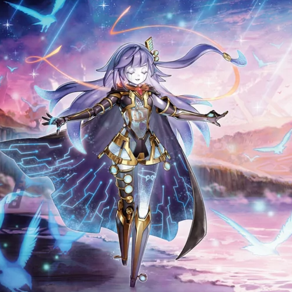
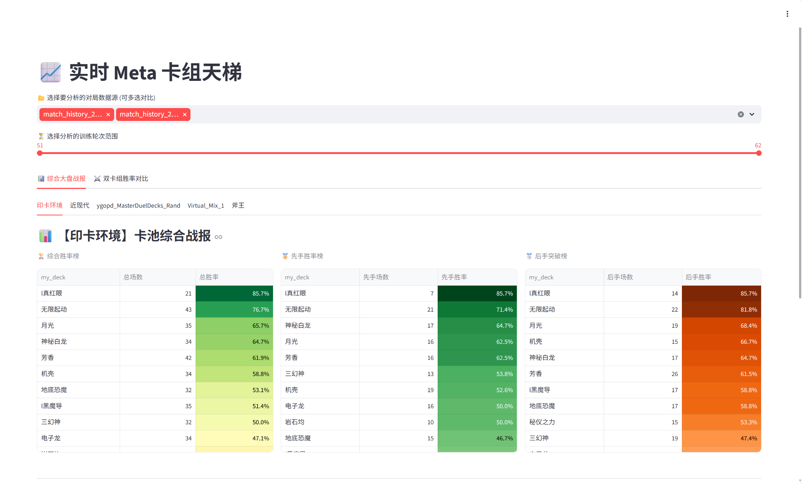
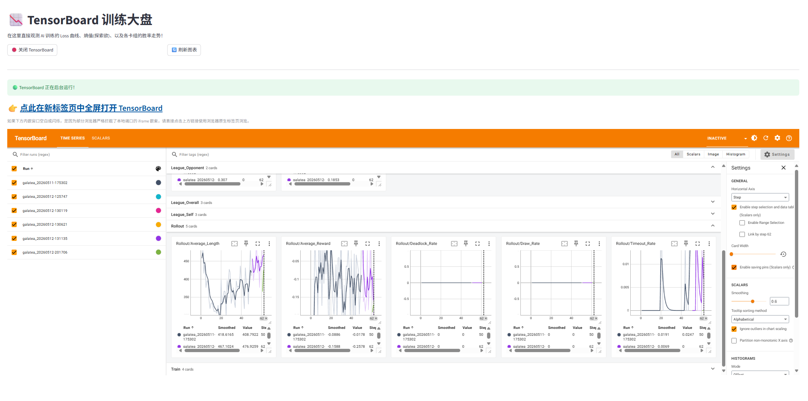
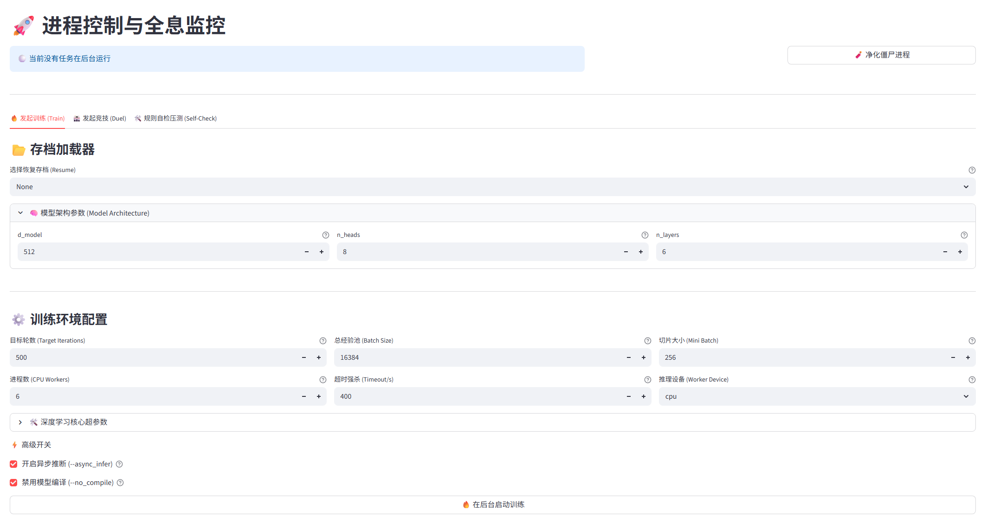
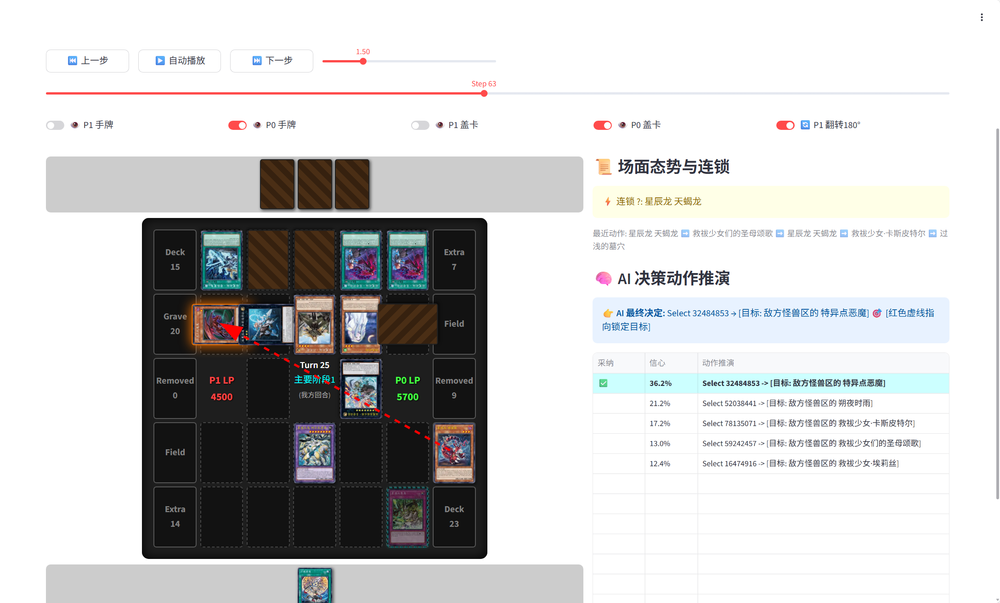

<div align="center">



# 🌟 Galatea-Core

**Yu-Gi-Oh! Universal AI Training Framework based on Transformer + PPO**

[](https://www.gnu.org/licenses/gpl-3.0)
[](https://www.python.org/downloads/)
[](https://pytorch.org/)

English | [简体中文](README.md)

</div>

---

## ✨ Key Features

- 🧠 **Universal AI Model** - Deck-agnostic, automatically parses Lua scripts to learn card effects
- 🎮 **Complete WebUI** - All-in-one training, testing, and management console
- 📦 **One-Click Package** - Built-in Python environment, just double-click to start
- 🔥 **Efficient Training** - Async inference + Mixed precision + League training mechanism
- 👁️ **Decision Visualization** - Holographic replay system to understand AI thinking process

---

## 🖥️ Showcase

<div align="center">

| | |
|:---:|:---:|
|  |  |
| **📈 Meta Dashboard** | **📉 Training Manifold** |
|  |  |
| **⚔️ Launch & Monitor Hub** | **👁️ Holographic Replay** |

</div>

---

## 🚀 Quick Start

### Windows Users

#### One-Click Package (Recommended, no Python setup required)

1. Download and extract the integrated package
2. Double-click `一键包启动Webui.bat`
3. Browser automatically opens the WebUI

#### Manual Install (Developers)

```bash
# Clone repository
git clone https://github.com/Noctfom/Galatea-Core.git
cd Galatea-Core

# Install dependencies (adjust PyTorch index-url for your CUDA version)
pip install torch --index-url https://download.pytorch.org/whl/cu121
pip install -r requirements.txt

# Prepare resource files
python main.py update --data

# Start WebUI
streamlit run app.py
```

### Linux Users

```bash
# Clone repository
git clone https://github.com/Noctfom/Galatea-Core.git
cd Galatea-Core

# One-click setup + launch (auto-detects GPU/CUDA, creates virtual environment)
chmod +x setup.sh
./setup.sh               # Install deps & launch WebUI
./setup.sh --train       # Install deps & launch CLI training
./setup.sh --duel        # Install deps & launch Arena

# Or manual install
python3 -m venv venv
source venv/bin/activate
pip install torch --index-url https://download.pytorch.org/whl/cu121
pip install -r requirements.txt
python main.py update --data
streamlit run app.py
```

📖 **Detailed Tutorial**: [Quick Start Guide](docs/quickstart_en.md)

---

## 🖥️ WebUI Features

| Module | Function |
|--------|----------|
| 📈 **Meta Dashboard** | Win rate stats, counter matrix |
| 📉 **Training Manifold** | Embedded TensorBoard |
| ⚔️ **Launch & Monitor Hub** | One-click training/arena |
| 🗃️ **Assets & Deck Management** | Deck upload, staple pool, weight scheduling, online fetching |
| 🔄 **Resource Sync Hub** | Auto-update card database |
| 🧠 **Semantic Knowledge Engine** | Lua script parsing |
| 📁 **Storage & Log Repository** | Manage project files |
| 📦 **Model Deploy & Packaging** | Import/Export model packages |
| 👁️ **Holographic Replay** | AI decision visualization |

---

## 📚 Documentation

| Document | Description |
|----------|-------------|
| [🚀 Quick Start](docs/quickstart_en.md) | Installation and first training in 5 minutes |
| [📚 Feature Guide](docs/features_en.md) | Complete WebUI and CLI guide |
| [🔧 Architecture](docs/architecture_en.md) | Technical principles and core algorithms |
| [🧬 Special Handling](docs/special_handling_en.md) | Implementation details of unique features |
| [📝 Changelog](docs/changelog_en.md) | Version history |

---

## 🛠️ CLI Commands

```bash
# Training
python main.py train --dir ./models --steps 1000 --async_infer --no_compile

# Arena
python main.py duel --p0 ./models/galatea_iter_100.pth --num 100

# Update resources
python main.py update --data

# Semantic parsing
python main.py parse --script_dir ./script
```

---

## 📋 System Requirements

| Component | Minimum | Recommended |
|-----------|---------|-------------|
| Python | 3.8+ | 3.10+ |
| GPU | GTX 1060 6GB | RTX 3060 12GB+ |
| RAM | 16GB | 32GB+ |
| Disk | 10GB | SSD |
| Linux | GLIBC ≥ 2.35 (Ubuntu 22.04+) | — |

---

## 🤝 Community

- **QQ Group**: 492420925
- **GitHub Issues**: [Submit an Issue](https://github.com/Noctfom/Galatea-Core/issues)
- 📧 Contact Author: noctfom114514@outlook.com

---

## 📄 License

This project is licensed under the [GNU General Public License v3.0](LICENSE).

---

## 🙏 Acknowledgements

- [YGOProCore](https://github.com/Fluorohydride/ygopro-core) - YGOPRO core engine, the foundation of everything
- [MDPro3](https://code.moenext.com/sherry_chaos/MDPro3) - MDPro3, the currently preferred client
- [YGOPro Official Scripts](https://github.com/Fluorohydride/ygopro-scripts) - Official Lua script repository, basis for card effect parsing
- [MyCard](https://github.com/mycard/ygopro-database) - cards.cdb card database source
- [YGOCDB](https://ygocdb.com/) - Card image rendering API and data query
- [YGOProDeck](https://ygoprodeck.com/) - Online deck data fetching source
- [YugiohAi](https://github.com/crispy-chiken/YugiohAi) - Tribute to fellow developers on the same path; referenced for post-v1.0 iteration optimizations
- [ygo-agent](https://github.com/sbl1996/ygo-agent) - Tribute to fellow developers on the same path; referenced for post-v1.0 iteration optimizations

---

<div align="center">

**If this project helps you, please give it a ⭐ Star!**

</div>
