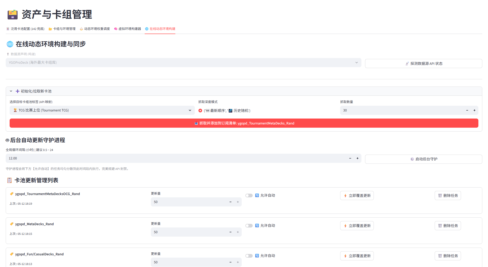
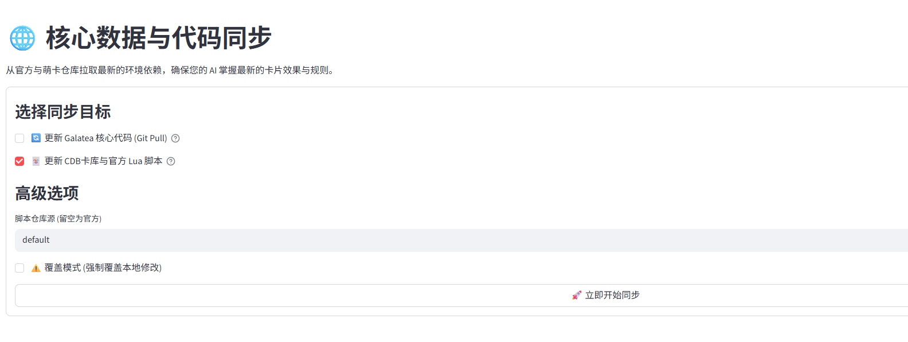
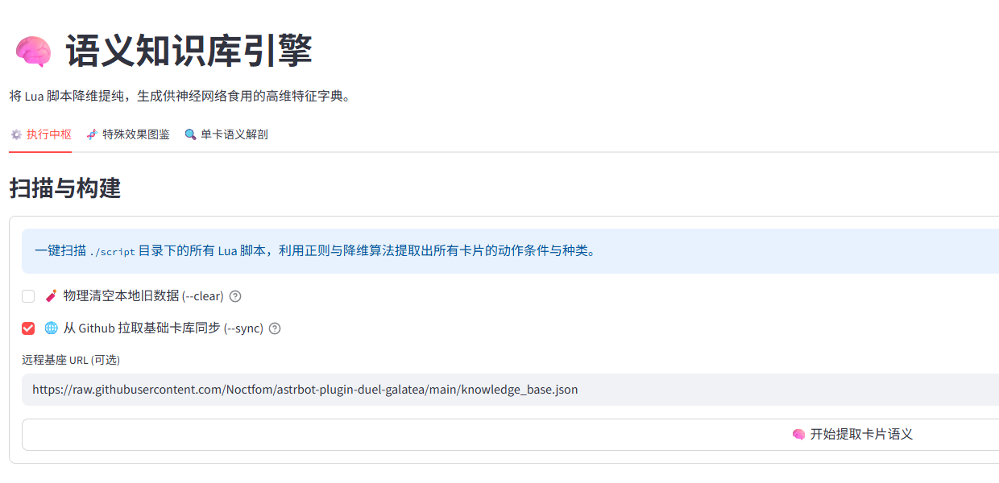
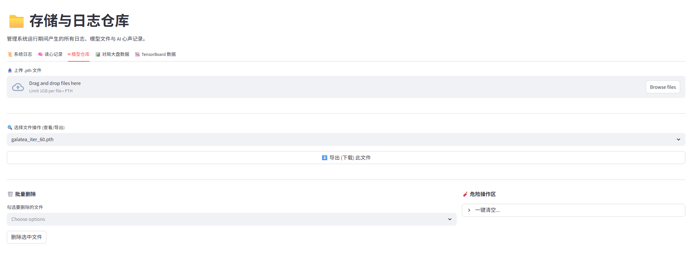

# 📚 功能详解

> 本文档详细介绍 Galatea-Core 的各个功能模块，包括 WebUI 界面和命令行工具。

> 文档适用于 **Galatea-Core v3.4.2**。

---

## 📋 目录

- [WebUI 模块详解](#webui-模块详解)
  - [卡组生态大盘](#卡组生态大盘)
  - [训练流形图](#训练流形图)
  - [启动与监控中枢](#启动与监控中枢)
  - [资产与卡组管理](#资产与卡组管理)
  - [资源同步中枢](#资源同步中枢)
  - [语义知识库引擎](#语义知识库引擎)
  - [存储与日志仓库](#存储与日志仓库)
  - [全息读心回放](#全息读心回放)
  - [模型部署与打包](#模型部署与打包)
- [模型部署工具](#模型部署工具)
- [参数详解](#参数详解)
- [常见问题](#常见问题)

---

## WebUI 模块详解

### 卡组生态大盘

**功能概述**：实时展示各卡组在训练过程中的胜率统计数据。

#### 主要功能

1. **综合大盘战报**
   - 综合胜率榜：所有卡组的总体胜率排名
   - 先手胜率榜：各卡组先手时的胜率
   - 后手突破榜：各卡组后手时的胜率
   - 克制矩阵：卡组之间的相互克制关系

2. **双卡组胜率对比**
   - 选择两个卡组进行详细对比
   - 查看直接交锋记录
   - 分析先后手优劣势

#### 使用方法

1. 在侧边栏选择 **📈 卡组生态大盘**
2. 使用滑块选择要分析的训练轮次范围
3. 切换不同的环境池（如果有多个卡组文件夹）
4. 查看各项统计数据


---

### 训练流形图

**功能概述**：内嵌 TensorBoard，实时监控训练过程中的各项指标。

#### 主要指标

| 指标 | 含义 | 理想趋势 |
|------|------|----------|
| `Train/Total_Loss` | 总损失 | 逐渐下降 |
| `Train/Policy_Loss` | 策略损失 | 逐渐下降 |
| `Train/Value_Loss` | 价值损失 | 逐渐下降 |
| `Train/Entropy` | 探索熵值 | 缓慢下降 |
| `Rollout/Average_Reward` | 平均奖励 | 逐渐上升 |
| `League_Overall/WinRate_Total` | 总胜率 | 逐渐上升 |

#### 使用方法

1. 在侧边栏选择 **📉 训练流形图**
2. 点击 **🚀 启动 TensorBoard** 按钮
3. 等待 TensorBoard 服务启动
4. 在内嵌窗口中查看曲线，或点击链接在新标签页打开


---

### 启动与监控中枢

**功能概述**：训练和竞技场的核心控制面板。

#### 三大功能标签页

##### 🔥 发起训练 (Train)

配置并启动 AI 训练任务。

**存档加载器**：
- 选择已有的 `.pth` 模型文件继续训练
- 选择 "None" 从零开始训练
- 新训练可设置模型前缀，`model_id` 由框架自动生成 UUID，不提供手动修改入口
- 恢复训练会从检查点继承 UUID、前缀、内置轮次与网络架构，并校验目录中的身份冲突

**模型架构参数**：
| 参数 | 说明 | 默认值 |
|------|------|--------|
| d_model | 特征维度 | 256 |
| n_heads | 注意力头数 | 4 |
| n_layers | Transformer 层数 | 2 |

> ⚠️ 恢复训练时，架构参数会自动锁定为存档中的配置。

**训练环境配置**：
| 参数 | 说明 | 默认值 |
|------|------|--------|
| 目标轮数 | 训练总迭代次数 | 5000 |
| 总经验池 | 每次更新前采集的步数 | 4096 |
| 切片大小 | PPO 单次训练批量 | 512 |
| 进程数 | 并行采集进程数 | 4 |
| 训练设备 | auto / cpu / cuda | auto |

**高级开关**：
- **中央批量推理**：固定启用；所有 Worker 固定使用 CPU
- **禁用编译**：Windows 或编译器环境不完整时建议开启
- **导出 ONNX**：每 10 轮保存点同步导出，供历史对手在 Worker 端使用
- **标准内核**：自编译 OCGCore 不含幽灵字节时启用

##### 🏟️ 发起竞技 (Duel)

让训练好的模型进行对战测试。

**配置项**：
- P0 模型：出战的 AI 模型
- P1 模型：对手（选择 "None" 则对战 RuleBot）
- 对战局数：测试的总局数
- 读心频率：每隔 N 局保存一次 AI 决策记录

##### 🛠️ 规则自检压测 (Self-Check)

使用纯规则 Bot 进行高速对战，检验引擎和脚本的稳定性。

#### 实时终端映射

页面底部显示实时的训练/竞技日志：
- **完整终端日志**：显示所有输出
- **异常警报分离器**：自动提取错误信息


---

### 资产与卡组管理

**功能概述**：管理卡组文件、泛用卡池、环境权重和虚拟拼装池。

#### 🃏 泛用卡池配置 (142 兜底)

当 AI 遇到需要宣言卡片的效果时，会优先从这个池子中选择。

**功能**：
- 添加新卡：输入 8 位卡片密码添加
- 移除卡片：选择并删除不需要的卡片
- 预览列表：查看当前池中的所有卡片

> 📖 详见 [特殊处理逻辑 - 142 宣言池包装逻辑](special_handling.md#142-宣言池包装逻辑)

#### 📂 卡组与环境管理

管理 `decks/` 目录下的卡组文件。

**功能**：
- 上传卡组：支持 `.ydk` 格式
- 创建子文件夹：作为不同的"环境池"
- 全息卡组阅览：可视化查看卡组内容
- 批量操作：移动、删除卡组文件

#### 🌐 在线动态环境构建

从 YGOProDeck 等在线卡组库自动抓取卡组，并设置自动更新。



**功能**：
- 选择目标标签（如 TCG 比赛上位、竞技天梯、娱乐卡组等）
- 设置抓取数量和深度模式（最新/历史随机）
- 一键抓取自动创建环境池
- **后台守护进程**：设置全局循环间隔后，可在后台自动定时从 API 拉取新卡组，确保 AI 始终面对最新的环境构筑

**可用标签**：
| 标签 | 来源 |
|------|------|
| 🏆 TCG/OCG 比赛上位 | 各赛事上位卡组 |
| ⚔️ 竞技天梯 | 环境主流卡组 |
| 🎉 非主流/绝活 | 冷门构筑 |
| 📺 动漫主题 | 动画角色卡组 |
| 🕰️ 特殊赛制 | Edison/Goat/Speed Duel |

#### ⚖️ 动态环境权重调度

控制各环境池在训练中的采样概率。

**功能**：
- 为每个环境池设置权重（0.0 ~ 10.0）
- 按来源分类管理（在线池/虚拟池/本地池）
- 批量设值一键覆盖同类所有权重
- 实时生效，Worker 下局即读取

> 📖 详见 [特殊处理逻辑 - 卡组权重调整](special_handling.md#卡组权重调整global-weights)

#### 🧠 虚拟环境构建器

创建跨环境池混合配方，让不同物理池的卡组可以跨池对战。

**功能**：
- 创建虚拟拼装池配方
- 混合多个物理环境池并设置各池权重
- 创建后自动出现在全局权重面板

> 📖 详见 [特殊处理逻辑 - 虚拟伪装池模块](special_handling.md#虚拟伪装池模块virtual-mix-pools)

---

### 资源同步中枢

**功能概述**：从官方仓库同步最新的卡片数据和脚本。

#### 同步目标

- **更新核心代码**：从 GitHub 拉取最新的框架代码
- **更新 CDB 卡库与脚本**：从萌卡/官方仓库同步 `cards.cdb` 和 `script/`

#### 高级选项

- **脚本仓库源**：指定自定义的脚本仓库地址
- **覆盖模式**：强制覆盖本地修改



---

### 语义知识库引擎

**功能概述**：解析 Lua 脚本，提取卡片效果的语义特征供 AI 学习。

#### ⚙️ 执行中枢

扫描 `script/` 目录下的所有 Lua 脚本，提取语义信息。

**选项**：
- **物理清空**：删除本地旧数据，重新全量解析
- **Github 同步**：从远程仓库拉取基础知识库

#### 🧬 特殊效果图鉴

查看通过 Hash 聚类压缩的特殊效果。

**功能**：
- 查看每个 Hash 标签对应的底层逻辑代码
- 查看共用该逻辑的所有卡片

#### 🔍 单卡语义解剖

输入卡片密码，查看 AI 视角下的语义特征。



---

### 存储与日志仓库

**功能概述**：管理系统运行产生的各类文件。

#### 管理的文件类型

| 标签页 | 目录 | 文件类型 |
|--------|------|----------|
| 系统日志 | `./system_logs/` | `.log` |
| 读心记录 | `./ai_thoughts/` | `.json` |
| 模型仓库 | `./models/` | `.pth`、`.onnx`、`.onnx.data`、`.artifacts.json` |
| 对局数据 | `./web_data/` | `.csv` |
| TensorBoard | `./runs/` | 二进制 |

#### 通用功能

- 查看/预览文件内容
- 导出（下载）文件
- 批量删除
- 一键清空（需二次确认）

模型仓库会以内置 `model_id` 为模型池、以内置轮次为制品组进行展示。上传 ONNX
时必须同时提供主图和其引用的 `.onnx.data`；删除轮次会同步删除该轮次的 PTH、
ONNX、外置权重和制品清单。

若目录中出现“同一前缀、不同 UUID”或“同一 UUID、多个前缀”，WebUI 会显示身份告警；
恢复训练和覆盖写入始终以内置 UUID 为鉴权依据，而不是只相信文件名。



---

### 全息读心回放

**功能概述**：可视化 AI 的决策过程，深入理解 AI 的"思考"逻辑。

#### 界面组成

1. **棋盘视图**
   - 真实坐标系的卡片布局
   - 动态显示手牌、场上、墓地等区域
   - 高亮显示 AI 选择的卡片和目标

2. **决策列表**
   - 显示所有可选动作
   - 显示每个动作的置信度（概率）
   - 高亮 AI 最终选择的动作

3. **播放控制**
   - 上一步/下一步
   - 自动播放（可调速度）
   - 时间轴滑块

#### 透视功能

- 👁️ P1 手牌：显示/隐藏对手手牌
- 👁️ P0 手牌：显示/隐藏己方手牌
- 👁️ P1 盖卡：显示/隐藏对手盖卡
- 👁️ P0 盖卡：显示/隐藏己方盖卡
- 🔄 P1 翻转：将对手视角旋转 180°


---

### 📦 模型部署与打包

**功能概述**：将训练好的模型与知识库封装成 `.gkg` 部署包，方便分享和导入。

#### 📥 封装部署文件 (Export)

将模型打包为 .gkg 格式：

- 先按内置 `model_id` 选择模型池，再选择该池内的 `.pth`/`.onnx` 主文件
- ONNX 引用的 `.onnx.data` 会自动补齐，不能单独遗漏
- 同时选择 PTH 与 ONNX 时，两种格式的内置轮次集合必须一致
- 可选包含知识库 (`knowledge_base.json`) 和泛用卡池 (`meta_staples.json`)
- 强制生成并校验清单文件 (`manifest.json`)
- 支持自定义包名

#### 📤 解包与选择性导入 (Import)

将外部 .gkg 包导入当前系统：

- 支持从本地文件系统直接解包（无需上传）
- 精细勾选要导入的模型和配置文件
- 暂存区管理（预览后再决定是否导入）
- 解包前限制路径、文件类型、成员数量、展开体积和压缩比；导入前重新核验 UUID、前缀与轮次

`.gkg` 包协议版本在 `model_artifacts.py` 的
`DEPLOY_PACKAGE_FORMAT_VERSION` 中独立维护，不与框架版本号共用。

---

## 命令行模式

除了 WebUI，Galatea-Core 也支持完整的命令行操作。

### 训练命令

```bash
python main.py train [选项]
```

| 选项 | 说明 | 默认值 |
|------|------|--------|
| `--dir` | 模型保存目录 | `./models` |
| `--target-iteration` | 训练停止时的绝对轮次，与追加轮数互斥 | - |
| `--additional-iterations` | 从当前检查点开始追加的轮数 | 新训练未指定时为 1000 |
| `--model-prefix` | 新模型文件前缀；恢复时自动继承 | `galatea` |
| `--deck_dir` | 卡组目录 | `./decks` |
| `--d_model` | 特征维度 | 256 |
| `--n_heads` | 注意力头数 | 4 |
| `--n_layers` | Transformer 层数 | 2 |
| `--resume` | 恢复训练的检查点 | - |
| `--batch_size` | 采集总步数 | 4096 |
| `--mini_batch` | PPO 单次训练批量 | 512 |
| `--workers` | 并行进程数 | 4 |
| `--device` | 训练主设备（auto / cpu / cuda） | auto |
| `--timeout` | Worker 单轮采集超时（必须大于 30 秒） | 300 |
| `--use_onnx` | 保存点同步导出 ONNX，并加速历史对手推理 | - |
| `--no_compile` | 禁用编译 | - |
| `--standard_core` | 关闭幽灵字节解析（自编译内核用） | - |
| `--gamma` | 折扣因子 | 0.998 |
| `--lr` | 学习率 | 1e-4 |
| `--entropy` | 熵正则系数 | 0.03 |
| `--gae_lambda` | GAE 平滑系数 | 0.95 |
| `--clip_eps` | PPO 截断阈值 | 0.2 |

`--target-iteration` 与 `--additional-iterations` 互斥。恢复训练必须显式选择其中一种；
新训练两者都省略时默认追加 1000 轮。`--model-prefix` 只允许字母、数字、下划线和短横线，
恢复训练时不得改写检查点中的前缀。

**示例**：

```bash
# 基础训练
python main.py train --dir ./models --additional-iterations 1000 --model-prefix galatea --no_compile

# 高级配置
python main.py train \
  --dir ./models \
  --additional-iterations 1000 \
  --model-prefix galatea \
  --batch_size 16384 \
  --mini_batch 512 \
  --workers 6 \
  --device auto \
  --d_model 512 \
  --n_heads 8 \
  --n_layers 6 \
  --no_compile

# 恢复训练
python main.py train \
  --resume ./models/galatea_iter_100.pth \
  --target-iteration 5000 \
  --device auto \
  --no_compile
```

### 竞技场命令

```bash
python main.py duel [选项]
```

| 选项 | 说明 | 默认值 |
|------|------|--------|
| `--p0` | P0 模型路径 | - |
| `--p1` | P1 模型路径（None 为 RuleBot） | - |
| `-n, --num` | 对战局数 | 100 |
| `--device` | 推理设备 | cpu |
| `--deck_dir` | 卡组目录 | `./decks` |
| `--thought_freq` | 心声保存频率 | 0 |
| `--standard_core` | 关闭幽灵字节解析（自编译内核用） | - |

竞技场会分别读取 P0/P1 检查点内置的模型架构，不接受外部参数改写。防死循环逻辑使用包含
场面、行动玩家、Select/Unselect 语义和目标实体的完整状态键；引擎 Retry 属于硬禁用，重复选择
属于不会独自耗尽候选池的软禁用，因此不会再把正常有限的模型分数误报为模型数值错误。

**示例**：

```bash
# AI vs RuleBot
python main.py duel --p0 ./models/galatea_iter_100.pth --num 100

# AI vs AI
python main.py duel --p0 ./models/model_a.pth --p1 ./models/model_b.pth --num 100

# 保存心声记录
python main.py duel --p0 ./models/galatea_iter_100.pth --thought_freq 5 --num 100
```

### 自检命令

```bash
python main.py play [选项]
```

| 选项 | 说明 | 默认值 |
|------|------|--------|
| `-n, --num` | 对局数量 | 10 |
| `--deck_dir` | 卡组目录 | `./decks` |
| `--standard_core` | 关闭幽灵字节解析（自编译内核用） | - |

### 更新命令

```bash
python main.py update [选项]
```

| 选项 | 说明 |
|------|------|
| `--core` | 更新核心代码 |
| `--data` | 更新卡库和脚本 |
| `--repo` | 指定脚本仓库源 |
| `--force` | 强制覆盖本地修改 |

### 语义解析命令

```bash
python main.py parse [选项]
```

| 选项 | 说明 | 默认值 |
|------|------|--------|
| `--script_dir` | Lua 脚本目录 | `./script` |
| `--output` | 输出文件路径 | `knowledge_base.json` |
| `--clear` | 清空本地知识库 | - |
| `--sync` | 从远程拉取基础库 | - |

---

## 模型部署工具

Galatea-Core 提供了模型打包和部署工具，方便分享和导入训练好的模型。

### 启动部署工具

```bash
python deploy_tool.py
```

### 功能

#### 1. 打包新模型 (.gkg)

将训练好的模型打包成 `.gkg` 部署包，包含：
- 同一 `model_id` 池内的模型文件 (`.pth`/`.onnx`/`.onnx.data`)
- 知识库 (`knowledge_base.json`)
- 泛用卡池 (`meta_staples.json`)
- 清单文件 (`manifest.json`)

#### 2. 解包并导入系统

将 `.gkg` 部署包解压并导入到当前系统：
- 模型文件提取到 `./models/`
- 知识库文件覆盖到根目录
- 危险反序列化、越界文件名、压缩炸弹和身份/轮次不一致会被拒绝

---

## 参数详解

### 模型架构参数

| 参数 | 说明 | 调整建议 |
|------|------|----------|
| `d_model` | 特征维度 | 越高越聪明，但计算量成倍增加。必须能被 `n_heads` 整除 |
| `n_heads` | 注意力头数 | 通常设为 4 或 8。头越多，处理复杂关系能力越强 |
| `n_layers` | Transformer 层数 | 2 层适合快速实验，4-6 层适合竞技卡组 |
| `vocab_size` | 卡片词表大小 | 只要比实际卡片 ID 总数大即可 |

### 训练参数

| 参数 | 说明 | 调优关联 |
|------|------|----------|
| `batch_size` | 采集总步数 | ⬆️ **内存**（主要）—— 越大训练越稳定，但需要更多内存 |
| `mini_batch` | PPO 单次训练批量 | CUDA 模式主要占用显存；CPU 模式主要占用内存 |
| `workers` | 并行进程数 | ⬆️ **内存**（主要）—— 根据 CPU 核心数调整，通常 4-12 |
| `timeout` | Worker 单次采集超时 | 防止进程僵死，默认 300s，大型卡组可设 600s |
| `device` | 训练主设备 | `auto` 优先 CUDA；`cpu` 仅用 CPU；Worker 始终使用 CPU |
| `use_onnx` | 历史对手 ONNX 推理 | 保存点同步导出完整 ONNX 制品；运行失败时自动回退历史 PTH |
| `no_compile` | 禁用编译 | Windows 或老旧环境建议启用 |

#### RL 灵魂超参数（深层调优）

以下参数可在 WebUI 或命令行中调整，用于精细控制 PPO 算法的学习行为：

| 参数 | 命令行 | 说明 | 默认值 | 调整建议 |
|------|--------|------|--------|----------|
| 目光长远度 | `--gamma` | 折扣因子 (Gamma) | 0.998 | 越高越重视远期收益，适合长盘对局 |
| 学习率 | `--lr` | 大脑神经元重塑速度 (LR) | 1e-4 | 太高训练震荡，太低收敛缓慢 |
| 探索系数 | `--entropy` | 探索欲/好奇心强度 | 0.03 | 鼓励 AI 尝试新操作；训练中保持设定值 |
| 经验平滑度 | `--gae_lambda` | GAE (广义优势估计) λ | 0.95 | 平衡预测的偏差和方差，一般不用改 |
| 单次顿悟上限 | `--clip_eps` | PPO 截断阈值 (Clip ε) | 0.2 | 限制单次策略更新幅度，防止学"飘"了 |

---

## 常见问题

### Q1: CUDA Out of Memory（显存不足）

**解决方案**：

```bash
# 方案 1: 切换为仅 CPU 训练
python main.py train --device cpu

# 方案 2: 降低mini_batch
python main.py train --mini_batch 256

# 方案 3: 减少 Worker 数量
python main.py train --workers 2
```

### Q2: Out of Memory（内存不足）

**解决方案**：

```bash
# 方案 1: 减少 Worker 数量
python main.py train --workers 2

# 方案 2: 降低 Batch Size
python main.py train --batch_size 4096
```

Windows 会在每轮启动 Worker 前显示“系统提交余量”和“本轮安全需求”。如果预检拒绝启动，除减少
Worker/Batch 外，还应关闭高内存程序或扩大系统页面文件；单纯增加 ZMQ 超时无法解决提交内存不足。
正常训练会跨轮复用主进程轨迹合并池；只有预检余量不足时才释放已完成训练的旧池并复检一次。
可对照“内存快照”和各 Worker 的“对手后端”日志，判断增长来自主进程常驻池还是 hist/ONNX 单轮峰值。

### Q3: Windows 下 torch.compile 报错

**解决方案**：

添加 `--no_compile` 参数，或在 WebUI 中勾选"禁用模型编译"。

### Q4: 训练速度很慢

**可能原因和解决方案**：

1. **没有使用 GPU**：使用 `--device auto` 并确保 PyTorch 正确识别 CUDA
2. **Worker 数量过多**：减少 `--workers` 参数
3. **CPU 线程竞争**：减少 Worker 数量，为中央推理和 PPO 更新保留核心

### Q5: 模型训练不收敛

**可能原因和解决方案**：

1. **学习率过高**：通过 `--lr` 或 WebUI 调低学习率
2. **批量太小**：增大 `--batch_size` 参数
3. **卡组太少**：添加更多卡组到 `decks/` 目录

### Q6: 找不到 cards.cdb 或 script 目录

**解决方案**：

使用内置更新工具下载：

```bash
python main.py update --data
```

或在 WebUI 的 **🔄 资源同步中枢** 中点击同步。

---

## 下一步

- 🔧 阅读 [架构设计](architecture.md) 深入理解框架原理
- 📝 查看 [更新日志](changelog.md) 了解版本变化
- 🚀 返回 [快速上手](quickstart.md) 开始训练
