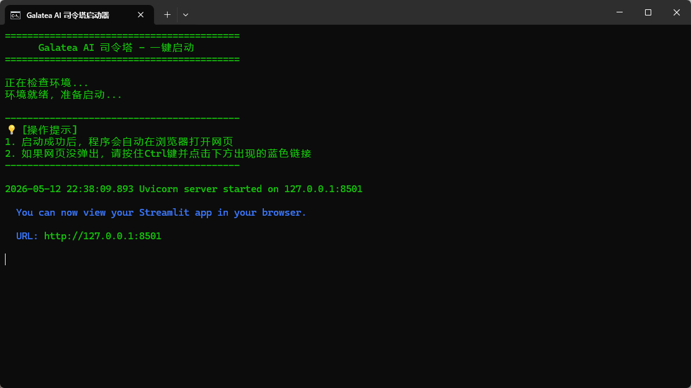
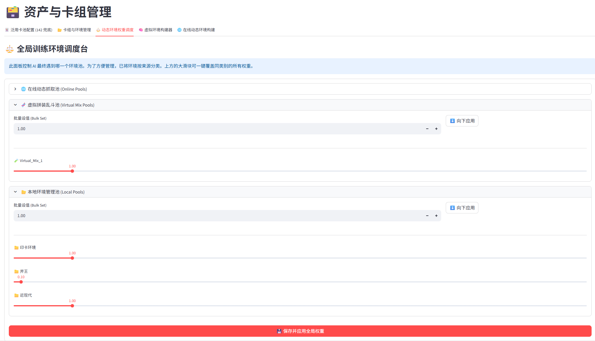
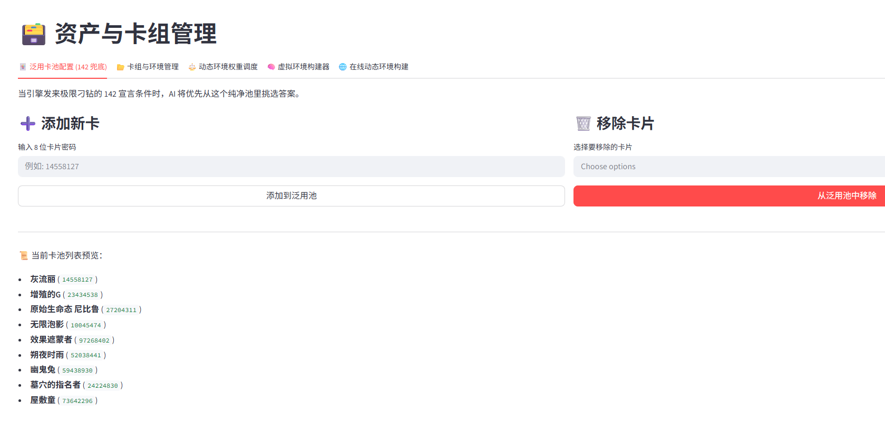

# 🚀 Quick Start Guide

> Zero to first AI training in **5-10 minutes**.

> This document applies to **Galatea-Core v3.6.2**.

---

## 📋 Table of Contents

- [One-Click Launch](#one-click-launch)
- [Sync Resources & Card DB](#sync-resources--card-db)
- [Build Semantic Knowledge Base](#build-semantic-knowledge-base)
- [Prepare Decks](#prepare-decks)
- [Adjust Deck Weights (Optional)](#adjust-deck-weights-optional)
- [Check Special Announce Pool (Optional)](#check-special-announce-pool-optional)
- [RuleBot Stress Test (Optional)](#rulebot-stress-test-optional)
- [Start Training](#start-training)
- [View Training Results](#view-training-results)
- [Arena Model Testing](#arena-model-testing)
- [[Alternate] Using Packaged Models](#alternate-using-packaged-models)

---

## One-Click Launch

### Windows Users

Double-click `一键包启动Webui.bat`. The launcher verifies and repairs dependencies before opening
`http://127.0.0.1:8501`.



> 💡 If the browser does not open, manually visit `http://127.0.0.1:8501`

The current Windows bundle supports RTX 20/30/40/50 and GTX 16 series GPUs. Systems
without a compatible GPU automatically use CPU mode; GTX 10 and older GPUs need an older
PyTorch build compatible with their architecture for GPU training.

Maintainers can double-click `构建一键包.bat` in the project root to create a release.
After validation, it writes `Galatea_Core_Vx.x.x.zip` without including local models,
logs, or training data.

### Linux Users

Use the repository setup script to create the environment and launch the desired mode:

```bash
cd Galatea-Core
chmod +x setup.sh
./setup.sh               # Install dependencies and launch WebUI
./setup.sh --train       # Install dependencies and launch CLI training
./setup.sh --duel        # Install dependencies and launch Arena
```

---

## Sync Resources & Card DB

Go to **🔄 Resource Sync Hub**:

1. Check **🃏 Update CDB Database & Official Lua Scripts**
2. Click **🚀 Start Sync**


Wait a few minutes. This pulls the latest `cards.cdb` and `script/` from official repos.

---

## Build Semantic Knowledge Base

Go to **🧠 Semantic Knowledge Engine**:

1. ⚠️ **Important**: Check **🌐 Sync Base KB from Github** to retrieve the KB, Hash map, and code-semantic vectors
2. Sync mode automatically appends vectors for newer local scripts; enable **Extract Code Semantic Features** separately only for a local-only update
3. Click **🧠 Start Extracting Card Semantics**


> 📖 See [Special Handling - Semantic KB](special_handling.md#语义化模块semantic-kb) for Hash clustering details.

Wait for parsing to complete (first time may take several minutes). Structured knowledge, the Hash continuation index, and code-semantic vectors are stored together in the project root.

After training or Arena starts, open **Semantic Knowledge Engine → V3 Observation Audit** to inspect automatic reports. Before the first real training run, use **Validate Semantic Bundle**; raw reports are also available under `system_logs/protocol_v3_audit/`.

---

## Prepare Decks

Multiple ways:

### Method 1: Use bundled test decks

The one-click package includes several `.ydk` test decks ready to use.

### Method 2: Manual upload

Go to **🗃️ Assets & Deck Management → 📂 Deck & Pool Manager**:
- Drag your `.ydk` files into the upload area
- Create subfolders for categorization (e.g. `tier1_meta`, `fun_decks`)

### Method 3: Online fetch (Recommended)

Go to **🗃️ Assets & Deck Management → 🌐 Online Fetcher**:
- Select target label (e.g. `🏆 Tournament TCG`, `⚔️ Meta Decks`)
- Set fetch quantity
- Click fetch to batch download decks automatically


---

## Adjust Deck Weights (Optional)

Go to **🗃️ Assets & Deck Management → ⚖️ Dynamic Pool Weights**:

- Set weight for each pool (0.0 ~ 10.0)
- Higher weight = AI trains more in that environment
- Adjust anytime, takes effect next game



> 📖 See [Special Handling - Global Weights](special_handling.md#卡组权重调整global-weights)

---

## Check Special Announce Pool (Optional)

Go to **🗃️ Assets & Deck Management → 🃏 Meta Staples (142 Cache)**:

- View current staple cards (default includes common handtraps: Ash Blossom, Maxx "C", etc.)
- Add/remove cards as needed



> 📖 See [Special Handling - 142 Announce Pool](special_handling.md#142-宣言池包装逻辑)

---

## RuleBot Stress Test (Optional)

Go to **⚔️ Launch & Monitor Hub → 🛠️ Rules Self-Check**:

- Set game count (recommend 50-100)
- Start to verify engine & script stability
- Run once before first training to ensure environment is healthy

---

## Start Training

Go to **⚔️ Launch & Monitor Hub → 🔥 Start Training (Train)**.

### Parameter Classification

Galatea-Core's training parameters are divided into three tiers:

| Tier | Parameters | Characteristics |
|------|-----------|-----------------|
| 🧠 **Brain Structure** | `d_model`, `n_heads`, `n_layers` | Like AI's brain capacity — fixed after definition (model architecture is locked) |
| ⚙️ **Training Config** | `batch_size`, `mini_batch`, `workers`, `timeout`, `device`, `no_compile`, plus RL hyperparameters below | Can be freely adjusted when resuming training |
| 🗂️ **Environment Config** | Deck weights, virtual pools, staple pool | Fully decoupled from training module, adjustable in real-time during training |

> ℹ️ When resuming, brain structure params are auto-locked from checkpoint. Training and environment configs can be freely modified.

> 🔐 New training automatically generates a read-only UUID. Resume inherits the UUID, model prefix,
> and embedded iteration. Filenames are descriptive; resume progress follows embedded metadata. The
> WebUI warns and rejects direct resume when the checkpoint protocol version differs.

### Parameter Quick Reference

| Parameter | Description | Beginner | Memory/VRAM Impact |
|-----------|-------------|----------|---------------------|
| **Checkpoint Loader** | "None" = train from scratch | None | - |
| **Model Prefix** | Output prefix for new models; inherited on resume | galatea | - |
| **d_model** | 🧠 Feature dimension (larger = more capacity) | 256 | ⬆️ RAM/VRAM |
| **n_heads** | 🧠 Attention heads | 4 | ⬆️ RAM/VRAM |
| **n_layers** | 🧠 Transformer layers | 2 | ⬆️ RAM/VRAM |
| **Iteration Mode** | Train to an absolute iteration or add iterations from a checkpoint | Add 1000 | - |
| **Batch Size** | Steps per collection | 4096 | ⬆️ RAM (primary) |
| **Mini Batch** | PPO update batch | 256-512 | VRAM in CUDA mode; RAM in CPU mode |
| **Workers** | Parallel worker processes | 4 (by CPU cores) | ⬆️ RAM (primary) |
| **Timeout** | Worker single-collection timeout | 300s | - |
| **Training Device** | auto / cpu / cuda | auto | Controls central inference and PPO device |
| **Export ONNX** | Synchronous historical-opponent export at checkpoints | As needed | Extra storage |
| **Disable Compile** | Recommended on Windows | On | - |

> 💡 **RAM/VRAM Tuning Rule**: `batch_size` and `workers` mainly consume RAM. In CUDA mode, `mini_batch` mainly consumes VRAM. Reduce workers for RAM pressure, reduce mini_batch or use `device=cpu` for VRAM pressure. Central batched inference is always enabled, and worker count should not exceed physical CPU cores.

### Recommended Configurations

#### 🧪 Beginner Test (Quick Validation)

| Parameter | Value |
|-----------|-------|
| d_model | 128 |
| n_layers | 2 |
| Target Iterations | 100 |
| Batch Size | 2048 |
| Mini Batch | 128 |
| Workers | 2 |
| Training Device | cpu or auto |
| Timeout | 300 |

#### 🏆 Full Training (Competitive)

| Parameter | Value |
|-----------|-------|
| d_model | 512 |
| n_layers | 6 |
| Target Iterations | 5000+ |
| Batch Size | 16384 |
| Mini Batch | 256 |
| Workers | 6-8 |
| Training Device | auto (prefers CUDA) |
| Timeout | 600 |

Click **🔥 Start Training Process**.


> 📖 Full CLI parameter reference: [Feature Guide - CLI Mode](features_en.md#cli-mode)

---

## View Training Results

### Live Logs

After training starts, view real-time logs at the bottom of **⚔️ Launch & Monitor Hub**.

### TensorBoard Curves

Go to **📉 Training Manifold**, click **🚀 Start TensorBoard** to view:

| Key Metric | Ideal Trend |
|------------|-------------|
| `Train/Total_Loss` | Decreasing |
| `Train/Entropy` | Slowly decreasing |
| `Rollout/Average_Reward` | Increasing |
| `League_Overall/WinRate_Total` | Increasing |

### Meta Dashboard

Go to **📈 Meta Dashboard** to view win rate stats and counter matrix.

---

## Arena Model Testing

After training, go to **⚔️ Launch & Monitor Hub → 🏟️ Start Arena (Duel)**:

1. **P0 Model**: Select your trained `.pth` model
2. **P1 Model**: Select "None" to fight RuleBot
3. Set game count and thought log frequency
4. Click **⚔️ Start Arena Process**

Results viewable in **📈 Meta Dashboard**. AI decision process replayable in **👁️ Holographic Replay**.


---

## [Alternate] Using Packaged Models

If you received a `.gkg` packaged model:

1. Go to **📦 Model Deployment → 📤 Unpack & Import**
2. Place `.gkg` in local packages folder
3. Select to unpack, check desired model/knowledge files
4. Click import

Imported models appear in `./models/`. Jump to [Arena Testing](#arena-model-testing) or [Holographic Replay](#view-training-results).

---

## Next Steps

- 📚 Read [Feature Guide](features.md) for detailed module usage
- 🔧 Read [Architecture](architecture.md) for framework internals
- 🧬 Read [Special Handling](special_handling.md) for unique features

Issues? [GitHub Issues](https://github.com/Noctfom/Galatea-Core/issues) or QQ Group **492420925**

📧 Contact: noctfom114514@outlook.com
